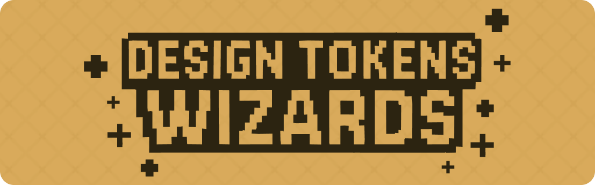
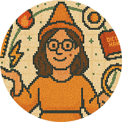

> This script is part of the [Design Tokens Wizards](https://github.com/fulviabuonanno/design-tokens-wizards) project, a collection of tools for generating and managing design tokens.

A powerful tool to generate Material Design color tokens and variables from base colors. This tool helps you create a complete Material Design color system with reference colors and system colors for both light and dark themes.

## 🧙 Getting Started

1. **Install Node.js**  
   Download and install [Node.js](https://nodejs.org/) on your machine.

2. **Install VS Code**  
   Download and install [Visual Studio Code](https://code.visualstudio.com/) for an enhanced development experience.

3. **Open Terminal**

   - **VS Code:** Press `` Ctrl + ` `` (Windows/Linux) or `` Cmd + ` `` (Mac)
   - **System Terminal:**
     - Windows: `Windows + R`, type `cmd`
     - Mac: `Command + Space`, type `terminal`
     - Linux: `Ctrl + Alt + T`

4. **Download/Clone the Repository**

   [Download ZIP](https://github.com/fulviabuonanno/material-color-wizard/archive/refs/heads/main.zip)

   or

   Clone Repo

   ```sh
   git clone https://github.com/fulviabuonanno/material-color-wizard.git
   cd material-color-wizard
   ```

5. **Install Dependencies**

   ```sh
   npm install
   ```

6. **Run the Material Spell**  
   Generate your Material Design color system:

   ```sh
   npm start
   ```

## 🎨 Material Design Color System Generator

The Material Design Color System Generator helps you create a complete color system following Material Design 3 guidelines. It generates both reference colors and system colors for light and dark themes.

### Color Categories

1. **Primary Colors**

   - Primary
   - On Primary
   - Primary Container
   - On Primary Container
   - Primary Fixed
   - On Primary Fixed
   - Primary Fixed Dim
   - On Primary Fixed Variant
   - Inverse Primary

2. **Surface Colors**

   - Background
   - On Background
   - Surface
   - Surface Bright
   - Surface Dim
   - On Surface
   - On Surface Variant
   - Surface Container (Lowest to Highest)
   - Surface Variant
   - Inverse Surface
   - Inverse On Surface
   - Shadow
   - Scrim
   - Surface Tint

3. **Outline Colors**

   - Outline
   - Outline Variant

4. **Error Colors**

   - Error
   - On Error
   - Error Container
   - On Error Container

5. **Secondary Colors**

   - Secondary
   - On Secondary
   - Secondary Container
   - On Secondary Container
   - Secondary Fixed
   - On Secondary Fixed
   - Secondary Fixed Dim
   - On Secondary Fixed Variant

6. **Tertiary Colors**
   - Tertiary
   - On Tertiary
   - Tertiary Container
   - On Tertiary Container
   - Tertiary Fixed
   - On Tertiary Fixed
   - Tertiary Fixed Dim
   - On Tertiary Fixed Variant

### Usage

1. **Run the Generator**

   ```sh
   npm start
   ```

2. **Enter Base Colors**
   Follow the interactive prompts to enter your base colors:

   - PRIMARY (required): Main color of your palette
   - SECONDARY (optional): Secondary color
   - TERTIARY (optional): Tertiary color
   - ERROR (optional): Error state color
   - NEUTRAL (optional): Neutral color for surfaces and backgrounds
   - NEUTRAL VARIANT (optional): Variant of neutral color

3. **Generated Output**
   The tool generates the following files in the `output_files/tokens/md` directory:

   **Reference Colors**

   - `ref/md-ref-color-tokens.json`: JSON tokens for reference colors
   - `ref/md-ref-color-variables.css`: CSS variables for reference colors
   - `ref/md-ref-color-variables.scss`: SCSS variables for reference colors

   **System Colors**

   - `sys/md-sys-color-tokens.json`: JSON tokens for system colors
   - `sys/md-sys-color-variables.css`: CSS variables for system colors
   - `sys/md-sys-color-variables.scss`: SCSS variables for system colors

## 🎯 Project Structure

```
src/
  material_spell.js    # Main Material Design color generator
output_files/
  tokens/
    md/
      ref/            # Reference color tokens
      sys/            # System color tokens
```

## 📦 Dependencies

| Dependency                             | Version | Description                              | Repository                                                                                  |
| -------------------------------------- | ------- | ---------------------------------------- | ------------------------------------------------------------------------------------------- |
| **@material/material-color-utilities** | ^0.2.0  | Material Design color utilities          | [material-color-utilities](https://github.com/material-foundation/material-color-utilities) |
| **chalk**                              | ^5.3.0  | Terminal string styling                  | [chalk/chalk](https://github.com/chalk/chalk)                                               |
| **inquirer**                           | ^9.2.12 | Interactive command line user interfaces | [SBoudrias/Inquirer.js](https://github.com/SBoudrias/Inquirer.js)                           |

## 📝 License

This project is licensed under the MIT License. This means you are free to use, modify, and distribute the software as long as the original copyright notice and permission notice are included in all copies or substantial portions of the software.

For more details, you can read the full license text in the [LICENSE](./LICENSE) file included in this repository or visit the Open Source Initiative for more information.

## ❓ Troubleshooting and FAQ

**Q: How can I provide feedback or report issues?**  
A: We welcome your feedback! You can:

- Reach out to me on our [website](https://designtokenswizards.framer.website/)
- Fill out this [form](https://tally.so/r/m6V6Po/)

**Q: I get a permission error or "command not found"?**  
A: Make sure you have Node.js (v18+) installed and are running commands from the project root.

**Q: Where are my generated files?**  
A: Check the `output_files/tokens/md/` directory.

**Q: Can I use these tokens with my design tool?**  
A: Yes! The tokens are exported in multiple formats (JSON, CSS, SCSS) that can be used with most design tools and development environments.

**Q: How do I update the tokens after making changes?**  
A: Simply run the generator again with your new values. The files will be updated automatically.

**Q: Can I use these tokens in my commercial project?**  
A: Yes! This project is licensed under MIT, which means you can use it freely in any project, including commercial ones.

**Q: What color formats are supported?**  
A: The generator supports HEX color codes for input and generates tokens in HEX format.

**Q: Can I use these tokens with my CSS framework?**  
A: Yes! The tokens are exported in standard formats (CSS, SCSS) that can be used with any CSS framework or vanilla CSS.

**Q: Something else isn't working!**  
A: Please [open an issue](https://github.com/fulviabuonanno/material-color-wizard/issues) or contact [me](mailto:designtokenswizards@gmail.com).

## 📬 Contact and Support

For questions, suggestions, or bug reports, please open an issue or [contact me](mailto:designtokenswizards@gmail.com).

## 🤝 Contributing

Contributions, issues, and feature requests are welcome!  
Feel free to check the [issues page](https://github.com/fulviabuonanno/material-color-wizard/issues) or submit a pull request.

Please see [CONTRIBUTING.md](CONTRIBUTING.md) for guidelines.

### ☕️ Support the Project

If you find this tool helpful and want to show your appreciation, consider buying me a coffee! Your support helps me maintain and improve the Material Color System, making it even more magical for everyone.

[](https://ko-fi.com/fbuonanno)

Every coffee helps me:

- Add new features and improvements
- Fix bugs and maintain the codebase
- Create more documentation and examples
- Keep the magic alive! ✨

Even a small contribution makes a big difference in keeping this project thriving. Thank you for being part of our magical community! 🧙‍♀️

---

## Created with Love in Barcelona by Fulvia Buonanno 🪄❤️



Discover more about our wizards at: [Material Color System Website](https://designtokenswizards.framer.website/)

If you're passionate about design systems and tokens, this tool is your perfect companion, allowing you to create tokens effortlessly. For RPG or JRPG fans, this tool will evoke a sense of nostalgia, blending classic gaming vibes with your design workflow. 🧩

Created with love by Fulvia Buonanno, a Design Systems Designer based in Barcelona, this tool aims to bridge the gap between design and development, making tokens more accessible, especially for newcomers to this magical world. 🧙
